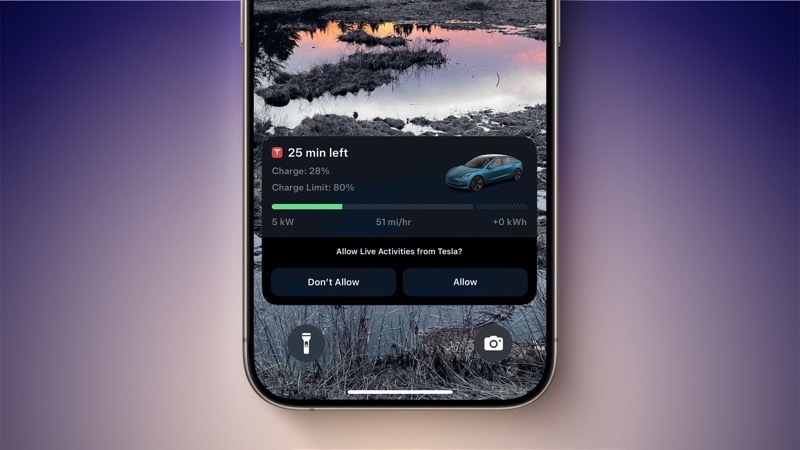

# iOS Live Activities Demo: EV Charging Simulation

A minimal SwiftUI app demonstrating Apple's **Live Activities** feature (iOS 16.1+). It simulates an electric vehicle (EV) charging session with real-time updates shown on the Lock Screen and Dynamic Island.

## Features
- Start, update, and end a Live Activity
- Displays battery percentage, charging speed, time remaining, cost, and status
- Supports Dynamic Island (expanded, compact, and minimal views)
- Pure SwiftUI + ActivityKit (no external dependencies)

## Prerequisites
- Xcode 15 or later
- iOS 16.1+ deployment target
- Physical device recommended for full Dynamic Island experience
- Enable **Supports Live Activities** in your app's Signing & Capabilities

## Project Structure
The project consists of a main app target and a widget extension target:

**Main App Files**
- `LiveActivitiesDemoApp.swift` – App entry point
- `HomeView.swift` – Simple UI with control buttons
- `HomeViewModel.swift` – Handles starting, updating, and ending the activity

**Shared/Widget Files**
- `LiveActivityWidgetAttributes.swift` – Defines attributes and dynamic state
- `EVChargingLiveActivityView.swift` – Lock Screen view
- `LiveActivityWidget.swift` – Widget configuration with Dynamic Island support
- `LiveActivityWidgetBundle.swift` – Widget bundle

## How It Works (Step-by-Step)

1. **Attributes & State**  
   `LiveActivityWidgetAttributes` defines fixed data (station name, vehicle ID) and dynamic `ContentState` (battery %, speed, etc.).

2. **Starting the Activity**  
   In `HomeViewModel.startCharging()`, request a new activity using `Activity.request()` with initial attributes and state.

3. **Updating Progress**  
   Call `activity.update()` with new state to reflect changes in real-time.

4. **Ending the Activity**  
   Use `activity.end()` with a final state and dismissal policy.

5. **UI Display**  
   - Lock Screen: Rendered via `EVChargingLiveActivityView`
   - Dynamic Island: Configured in `ActivityConfiguration` with leading/trailing/bottom regions

## How to Run
1. Open the project in Xcode.
2. Build and run on a device or simulator.
3. Tap **Start Charging** → Live Activity appears.
4. Tap **Update Charging** → See progress change.
5. Tap **End Charging** → Activity completes and dismisses.

## Customization Tips
- Change fixed attributes (e.g., station name) in `startCharging()`.
- Add more dynamic fields to `ContentState`.
- Enhance UI with animations or custom icons.

Minimal, clean, and ready to use as a reference for implementing Live Activities in your own apps!
